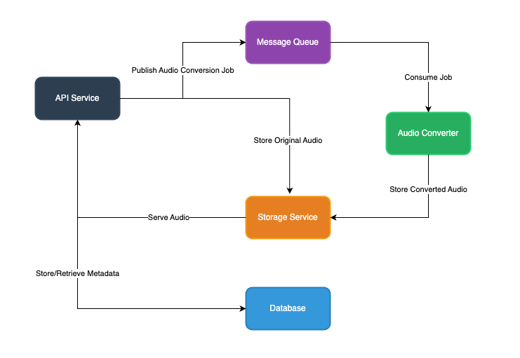

# Phonon Service

## Overview

Phonon is a simple scalable backend service that handles audio file storage and retrieval with format conversion.

### Core Features

- **Audio Upload**: Accept audio files in a specific format (currently M4A)
- **Format Conversion**: Convert between M4A (client) and WAV (storage) formats
- **Storage Management**: Store audio files with user and phrase associations
- **Retrieval**: Retrieve stored audio files in the original format (M4A)

### API Endpoints

```
POST /audio/user/{user_id}/phrase/{phrase_id}
- Accepts M4A audio file upload
- Converts to WAV for storage
- Associates file with user and phrase

GET /audio/user/{user_id}/phrase/{phrase_id}/m4a
- Retrieves stored audio file
- Converts from WAV to M4A
- Validates user and phrase IDs
```

## Quick Start

### Prerequisites

- Docker and Docker Compose

#### Optional - If you want to run the service without docker
- Go 1.23
- FFmpeg (for audio conversion)
- Kafka (Supported message queue)
- SQLite / MySQL

### Setup and Run
Easiest way to get started is to use Docker Compose. Assuming you have Docker and Docker Compose installed, you can run the service using the following command:

```bash
make run # or make run-scratch to start from scratch - deleting volumes and rebuilding images
```

### Sample API Usage

1. Upload an audio file:
```bash
curl --request POST 'http://localhost:8080/audio/user/1/phrase/1' \
  --header 'content-type: multipart/form-data' \
  --form 'audio_file=@"./test_audio_file_1.m4a"'
```

2. Get processed audio:
```bash
curl --request GET 'http://localhost:8080/audio/user/1/phrase/1/m4a' \
  -o './test_response_file_1_1.m4a'
```

### Makefile Commands
- `make setup`: Initializes the development environment by running the setup script which configures necessary environment variables and dependencies
- `make build`: Builds all Docker containers required for the service using Docker Compose
- `make run`: Sets up the environment in non-interactive mode (using default values) and starts all services in detached mode
- `make run-scratch`: Performs a clean restart by stopping all services, removing volumes, rebuilding containers, and starting fresh. Useful when you need a completely fresh environment
- `make clean`: Stops all running services and removes associated Docker volumes to clean up the environment
- `make test`: Executes all Go test suites in the project to verify functionality


### Architecture


### Implementation Scope

This is a simplified implementation focusing on core functionality:

- Basic database schema with user IDs and phrase IDs
- Simple file storage on local filesystem
- FFmpeg for audio format conversion
- No authentication/authorization (development purpose only)

### Design Decisions

- **Asynchronous Processing**: Chosen for better scalability as immediate audio retrieval wasn't a requirement
- **Audio Format Storage**: store both original and converted formats to prioritize fast upload and retrieval
- **Modular Database**: Supports both SQLite and MySQL
- **Modular Storage**: Flexible storage backend - currently only supports local filesystem (extensible to cloud storage like AWS S3)
- **FFmpeg Integration**: Industry-standard tool for reliable audio processing

## Project Structure

```
├── cmd/                 
│   ├── background/      # Background processing service
│   └── phonon/          # Main HTTP service application
├── pkg/                 
│   ├── api/             # REST API handlers and routing
│   ├── config/          # Configuration management
│   ├── converter/       # Audio format conversion package
│   ├── errors/          # Custom error definitions
│   ├── instrumentation/ # Logging and metrics
│   ├── middleware/      # HTTP middleware components
│   ├── model/           # Data models and structures
│   ├── queue/           # Message queue implementation
│   ├── repository/      # Database access layer
│   ├── service/         # Core business logic
│   └── storage/         # File Storage backend implementations
├── docs/                # Documentation and diagrams
├── scripts/             # Utility and setup scripts
└── sql/                 # Database migration scripts
```

## Improvement Areas

### Security
- Implement user authentication and authorization
- Add additional input validation and sanitization
- Secure file storage with proper permissions

### Scalability
- Use cloud storage (e.g., S3) for audio files
- Implement caching for frequently accessed files
- Add load balancing for high availability

### Reliability
- Add comprehensive error handling
- Implement retry mechanisms for failed operations
- Add automated backup solutions

### Monitoring
- Add detailed logging and metrics
- Integrate with distributed tracing
- Implement health checks
- Set up monitoring dashboards